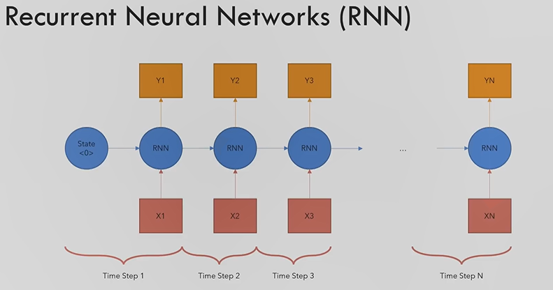

# Recurrent Neural Networks
## Overview:

* Maps one sequence of Inputs to a another sequence of outputs
* It takes first item and the hidden state (previous as input)
* For n tokens you need n steps

## Problems:
* Slow for long sequences
* Vanishing or exploding gradients:
    * Pytorch uses computational graphs to calculate the backpropagation (weight assigned to the nodes)
    * Usually for long chains, those gradients turn out very small (vanishing) or very large (exploding)
    * Vanishing gradients cause the weights to barely update
    * Exploding gradients make the network very unstable
    * This can also cause problems with the 32/64bit float limit
* Difficulty in accessing information from long time ago