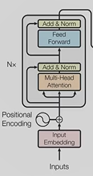
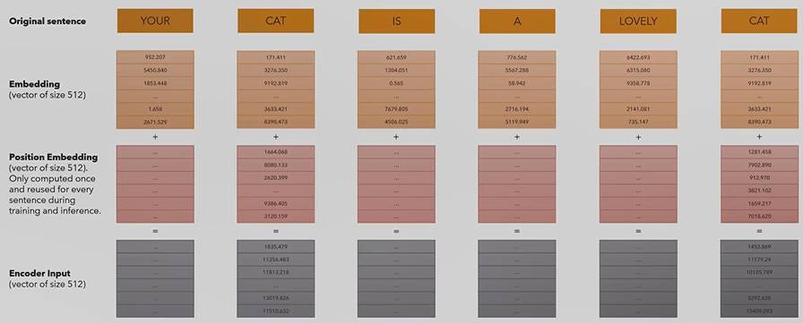

# General

## Encoder:

### 1. Input Embedding
* Allows us to convert a Sentence into a Vector of 512 Dimensions (Word Vector) using Input IDs
### 2. Positional Encoding
* Represents the position of the word in the sentence using a Vector of 512 Dimensions
* Also used for "teaching" the model sentence structure and grammar

-> add Input Embedding und Positional Encoding together to create the Encoder Input

### 3. Multi Head Attention

## Examples:

### Input Embedding + Positional Encoding:

## Decoder