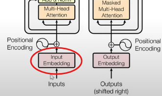
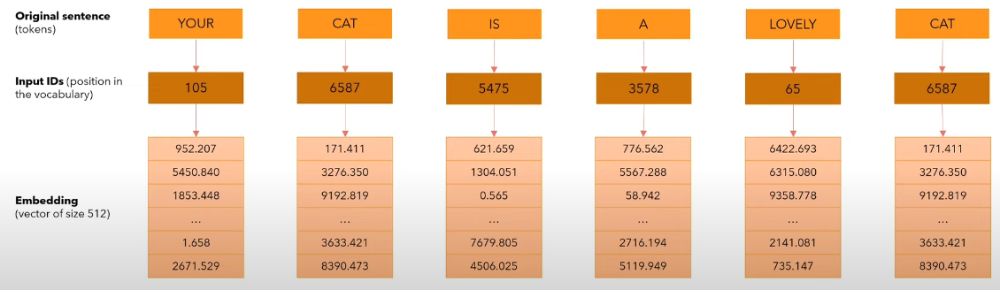
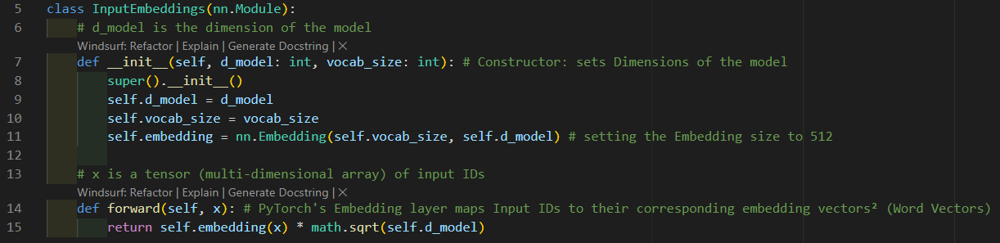

# Input Embedding
## Overview:
**Where are we?**

* Input Embedding allows us to convert a Sentence into a Vector of 512 Dimensions
* in this case: a **Word-vector**

**Example:**

* Turn the sentence into a list of **Input IDs**
* An Input ID is a number that correspond  to the position of each word in the vocabulary
* Each of these IDs correspond  to an Embedding (Vector of size 512)

 

## Code

* lines 5-15

**Missing:**
* Explaining the Equation

 

### Next up: [Positional Encoding](positional_encoding.md)
