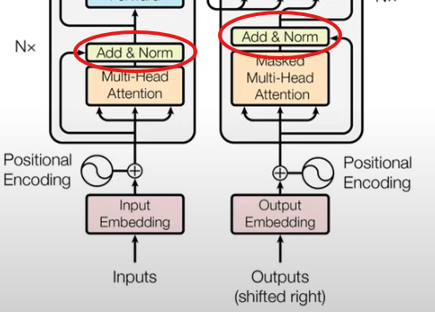
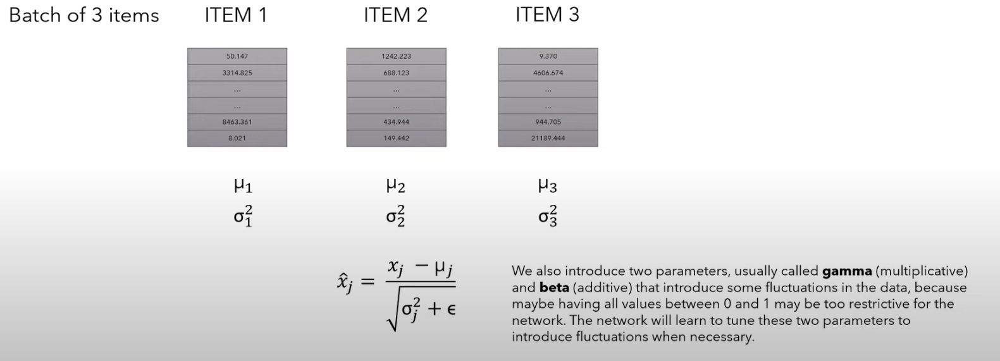

# Layer Normalization
## Overview:
**Where are we?**

* Layer Normalization normalizes each item in the batch across its features, then uses learnable scale and shift (gamma and beta) to help the model emphasize useful patterns.

**Example:**

* We have a Batch of n Items (each item has features)
* Then for each Item we calculate a mean and a variance across its features
* Then we calculate new values for each of the Items using the mean and variance (see **Equations**)
* We introduce two learnable parameters — gamma (scale) and beta (shift) — to let the model adjust the normalized output.
* The model learns to scale up or down certain features to emphasize what's important.

**Missing:**
* Explaining the Equation