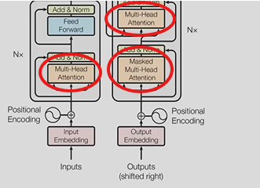
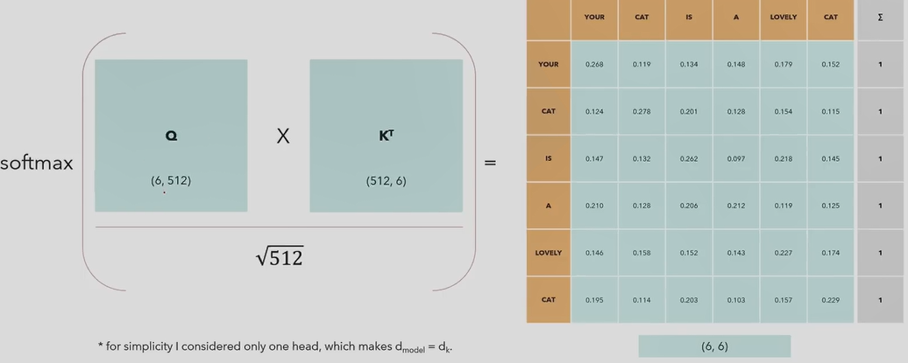
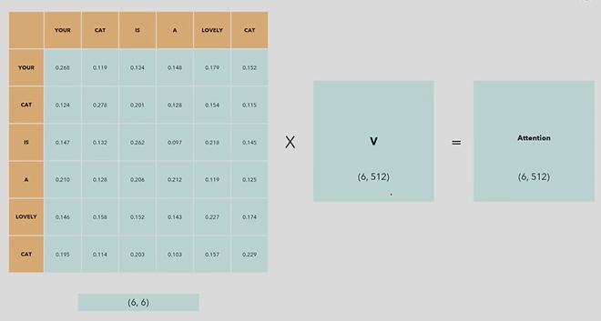
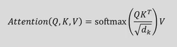

# Multi Head Attention
## Overview:
**Where are we?**

## Single Head Self Attention
* Self Attention allows the model to relate each word in a sentence to each other

* Q = Input Matrix, K = Input Matrix Transposed
* Turns the Matrix into a 6x6 Matrix, with each cell being the dot product of the respective row and column
* Every row sums up to 1
* For example, the cell [your, cat] is the dot product of the embedding of the word your and the embedding of the word cat
* this value shows how intense (likely) the relationship between one word and another is

* Then we

## Equations
