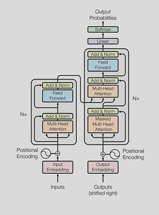

# Overview

* **Insert Screenshot of the Model with matching Numberings for table of contents**

## Table of contents
### 1. [General](general.md)
* ### [Encoder](general.md#encoder)
* ### [Decoder](general.md#decoder)
### 2. [Input Embedding](input_embedding.md)
### 3. [Positional Encoding](positional_encoding.md)
### 4. [Layer Normalization](layer_normalization.md)

## What should you already know?
* Matrix multiplication
* Dot product
* 

