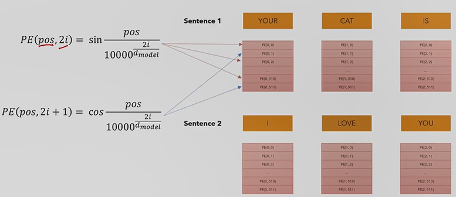
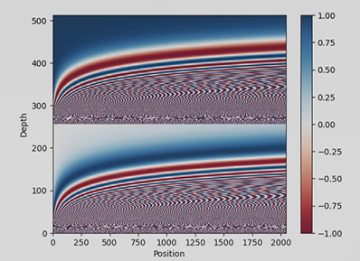

# Positional Encoding
## Overview:
**Where are we?**

* Positional Encoding is responsible for representing the position of the word in the sentence

**Example:**

* The model treats words that appear close to each other as "close" and ones that are distant as "distant"
* We do this by adding another vector (same size as the embedding) to encode the position of each word in the sentence.
* These patterns can then be learned by the model to make it "understand" grammar and sentence structure

 

## Equations
**Building Vectors:**

* pos = position of word in sentence
* first equation for even position and second equation for uneven positions
* These are only calculated once and can be reused for other sentences (same vector for different sentences)

## Why trigonometric functions?

* Makes relative positions easier to see for the model
* As you can see in the picture, there is a visible pattern in these functions. The model can also recognize those paterns

 

## Code
* lines 17-43

**Missing:**
* Equations Explaination
* Explain log stability

 

### Next up: [Layer Normalization](layer_normalization.md)
