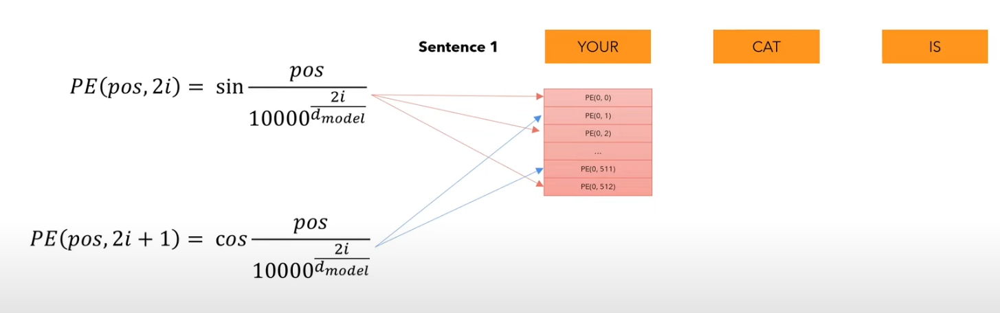
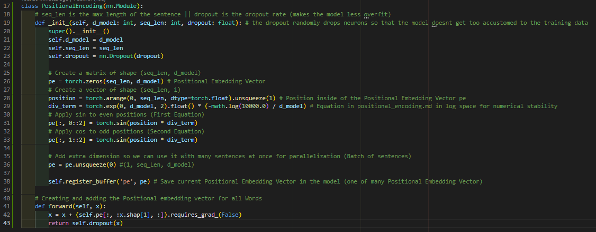

# Positional Encoding
## Overview:
**Where are we?**

* Positional Encoding is responsible for representing the position of the word in the sentence

**Example:**

* We do this by adding another vector (same size as the embedding) to encode the position of each word in the sentence.

 

## Equations
**Building Vectors:**

 

## Code
* lines 17-43

**Missing:**
* Equations Explaination

 

### Next up: [Layer Normalization](layer_normalization.md)
